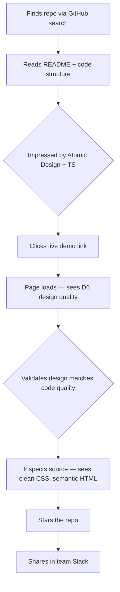
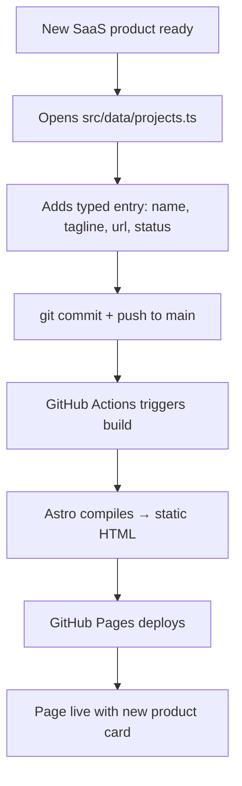

# UX Design Specification - presentation-github

**Author:** Aymeric
**Date:** 2026-01-23

---

## Executive Summary

### Project Vision

A broadly professional, premium single-page landing hub replacing Linktree — positioned as a SaaS + Builder + AI brand headquarters. The design must feel modern and accessible to any audience (not developer-niche), while the codebase quality speaks to technical visitors who inspect it.

### Target Users

- **Primary (Sophie):** Social media visitor, mobile device, short attention span, wants to follow/connect/explore. Non-technical to junior-dev range.
- **Secondary (Thomas):** Developer, desktop, evaluates code quality and design craft. Judges the repo.
- **Admin (Aymeric):** Updates content via TypeScript data files, expects zero-friction maintenance.

### Key Design Challenges

1. **Mobile-first with minimal content** — Page must feel intentional and premium with just a hero, 1-2 product cards, and social links.
2. **WCAG AAA + rich animations** — Premium visual effects that degrade gracefully for accessibility needs.
3. **20-second engagement window** — Identity and CTAs must communicate instantly, no cognitive load.

### Design Opportunities

1. **Micro-interactions as brand signature** — Hover effects, staggered entrances, memorable moments.
2. **Dark mode as premium default** — Modern, sophisticated first impression for majority of visitors.
3. **Whitespace as confidence** — Fewer elements + generous spacing signals quality over quantity.
4. **Visual hierarchy as storytelling** — Natural eye flow without navigation: Identity → Products → Social.

## Core User Experience

### Defining Experience

**Core Action:** Tap a social icon to follow Aymeric's journey.
**Core Goal:** Community growth — convert page visitors into social followers.
**Time Budget:** 5 seconds from landing to first social tap.

The page is a **conversion funnel for social following**, not a content destination. Visitors arrive, recognize credibility, and follow — fast.

### Platform Strategy

- **Primary:** Mobile web (social media link-in-bio traffic)
- **Secondary:** Desktop web (developer/recruiter traffic)
- **Input:** Touch (mobile primary), mouse/keyboard (desktop secondary)
- **Offline:** Not needed — static site, always available via CDN
- **Constraints:** GitHub Pages hosting, no server-side logic

### Effortless Interactions

- **Identity recognition:** Name + tagline readable in under 1 second
- **Social link discovery:** Icons visible without scrolling on any device
- **Tapping social icons:** Large, obvious, satisfying hover/tap feedback
- **Scrolling to products:** Natural, smooth, rewarding — not required for primary goal
- **Dark mode:** Automatic, no toggle needed (system-preference)

### Critical Success Moments

1. **First Impression (0-2s):** "This looks professional and premium" — animations load, identity is clear
2. **Social Discovery (2-5s):** "I can follow them here" — icons are prominent, inviting
3. **Credibility Boost (5-15s):** "They're building real things" — scroll reveals product cards with status badges
4. **Exit with Connection (15-20s):** Sophie leaves having tapped 1-3 social icons

### Experience Principles

1. **Social-first, products-second** — Social icons are the primary CTA; products reward curiosity
2. **Instant clarity** — Identity communicates within 1 second, no cognitive load
3. **Mobile-native feel** — Designed for thumb zones, touch targets, vertical flow
4. **Premium restraint** — Fewer elements, more whitespace, every pixel intentional

## Desired Emotional Response

### Primary Emotional Goals

- **Curiosity** — "I want to know more about this person and what they're building"
- Supported by: Information gaps, visual intrigue, teasing what's coming
- Design implication: Don't show everything flat — create layers of discovery

### Emotional Journey Mapping

| Moment | Emotion | Trigger |
|--------|---------|---------|
| First landing (0-1s) | Impressed + Curious | Premium animations, polished aesthetic |
| Hero section (1-3s) | Intrigued | Strong tagline, professional identity |
| Social icons (3-5s) | Desire to connect | "I want to follow this person's journey" |
| Scroll to products (5-15s) | FOMO | Status badges ("Building") hint at upcoming launches |
| Exit (15-20s) | Anticipation | "I followed, I won't miss what's next" |

### Micro-Emotions

- **Confidence** (not confusion) — Hierarchy is immediately obvious, no thinking required
- **Excitement** (not boredom) — Animations and micro-interactions create energy
- **Trust** (not skepticism) — Professional quality signals credibility
- **Anticipation** (not "meh") — "Building" status creates forward momentum

### Design Implications

- **Curiosity** → Staggered reveal animations (elements appear progressively, not all at once)
- **Impressed** → High production value: smooth transitions, polished typography, intentional spacing
- **FOMO** → "Building" and "Coming Soon" badges with subtle pulse or glow — something is happening
- **Avoid boredom** → Micro-interactions on every clickable element (hover, tap feedback)
- **Avoid confusion** → Single-column, clear visual hierarchy, no competing elements
- **Avoid "meh"** → At least one "wow" moment (entrance animation, unexpected visual effect)

### Emotional Design Principles

1. **Tease, don't tell** — Show enough to create curiosity, let social profiles fill in the story
2. **Reward exploration** — Each scroll reveals something worth discovering
3. **Create FOMO through progress** — Status badges signal momentum and upcoming events
4. **One "wow" moment** — A single memorable visual effect visitors will remember
5. **Never boring, never busy** — Energy through quality, not quantity

## UX Pattern Analysis & Inspiration

### Inspiring Products Analysis

| Product | Key UX Strength | Emotional Impact |
|---------|-----------------|-----------------|
| Apple | Whitespace as luxury, scroll-triggered reveals | Premium, confident |
| Webflow | Dark theme + gradient accents, sophisticated animations | Modern, tech-forward |
| Apple Siri | Organic glow/pulse, "living" ambient motion | Futuristic, intriguing |
| Notion | Content-first, effortless simplicity | Clean, focused |

**Common Thread:** Premium minimalism with life — clean and spacious, but with subtle motion and energy. Alive and intentional.

### Transferable UX Patterns

**Visual Patterns:**
- Apple's whitespace philosophy → Generous spacing between hero, social, products
- Webflow's dark-with-gradients → Dark mode with subtle gradient accents on cards/badges
- Siri's ambient glow → Subtle pulsing glow on "Building" status badges
- Notion's typography clarity → Bold name, light tagline, clean hierarchy

**Animation Patterns:**
- Apple's scroll-triggered reveals → Product cards animate in as user scrolls
- Webflow's staggered entrances → Social icons appear one by one on load
- Siri's organic motion → Subtle background gradient shift or floating particles
- Content progressive disclosure → Hero first, then social, then products

**Interaction Patterns:**
- Webflow's hover depth → Cards lift/glow on hover with smooth transition
- Apple's focal point → One primary element per viewport section
- Notion's invisible UI → No navigation, no chrome, just content

### Anti-Patterns to Avoid

- **Linktree's flat buttons** — Generic, no personality, no motion
- **Overloaded portfolios** — Too many sections, competing for attention
- **Gratuitous parallax** — Motion for motion's sake, distracting from content
- **Cookie-cutter templates** — Obviously "made with X" feel
- **Slow-loading animations** — Premium feel ruined by performance issues

### Design Inspiration Strategy

**Adopt:**
- Apple's whitespace + single focal point per section
- Siri's ambient glow for status badges
- Webflow's dark-with-gradient aesthetic
- Notion's content-first, invisible-UI philosophy

**Adapt:**
- Apple's scroll animations → simplified for <50KB bundle constraint
- Webflow's sophisticated transitions → CSS-only for performance
- Siri's organic motion → subtle, not distracting, respects reduced-motion

**Avoid:**
- Any motion that delays access to social icons
- Animations that require JavaScript libraries (keep bundle small)
- Visual complexity that creates confusion or overwhelm

## Design System Foundation

### Design System Choice

**Custom Design System on Tailwind CSS** — hand-crafted components with design tokens, zero external UI library dependencies.

This is a fully custom approach where every component is designed from scratch using Tailwind utility classes, with a structured token system defined in `tailwind.config.ts`. No pre-built component library (MUI, Chakra, Tailwind UI) is used.

### Rationale for Selection

| Factor | Decision Driver |
|--------|----------------|
| Component count | Very few components needed (hero, card, icon, badge) — a library is overkill |
| Visual uniqueness | Premium, Apple/Webflow-inspired aesthetic requires custom design |
| Bundle constraint | < 50KB total — no room for UI library JavaScript |
| Astro philosophy | Zero-JS by default — CSS-only components fit perfectly |
| WCAG AAA | Contrast ratios configured directly in color palette tokens |
| Solo developer | Simple project, manageable without library abstractions |
| Brand identity | Must not feel "template-like" — custom is the only path to premium uniqueness |

### Implementation Approach

**Design Tokens (tailwind.config.ts):**
- Custom color palette with WCAG AAA-compliant contrast ratios (7:1 normal, 4.5:1 large)
- Spacing scale tuned for generous whitespace (Apple-inspired)
- Typography scale: bold headings, light body, clean hierarchy
- Animation timing tokens: entrance durations, easing curves, stagger delays
- Border radius, shadow, and glow tokens for card/badge effects

**CSS Custom Properties:**
- Dark mode via `prefers-color-scheme` media query
- Semantic color variables (--color-surface, --color-text-primary, --color-accent)
- Animation variables that respect `prefers-reduced-motion`

**Component Architecture (Atomic Design):**
- Each `.astro` component is self-contained with scoped styles
- Atoms: Avatar, StatusBadge, SocialIcon, GlowEffect
- Molecules: ProductCard, SocialLink, TagBadge
- Organisms: HeroSection, ProductList, SocialBar
- No shared CSS files — each component owns its styles via Tailwind classes

### Customization Strategy

**Brand Differentiation:**
- Custom gradient accents (Webflow-inspired) defined as Tailwind utilities
- Ambient glow effects (Siri-inspired) via CSS `box-shadow` and `filter` tokens
- Staggered entrance animations via CSS `animation-delay` custom properties
- Hover depth effects (transform + shadow transitions) on interactive elements

**Scalability:**
- New components follow Atomic Design conventions
- Design tokens ensure consistency across future additions
- Adding a product card = adding a data entry, not designing a new component

**Accessibility Integration:**
- Color tokens include both light and dark mode variants, all AAA-compliant
- Focus ring styles defined as reusable Tailwind utilities
- Motion tokens have `prefers-reduced-motion` fallbacks built-in
- Touch targets enforced via minimum sizing utilities (44x44px)

## Defining Experience Deep-Dive

### User Mental Model

Visitors arrive with a **Linktree mental model**: profile photo → list of links → tap one → leave. They expect this to take 5-10 seconds. Our design leverages this familiarity while elevating the experience:

- **Familiar:** Single page, profile at top, links below
- **Elevated:** Visual hierarchy guides attention (not a flat list), animations create energy, product cards add credibility
- **Surprise:** The quality gap between expectation (Linktree) and reality (premium landing) creates the "wow" moment

### Core Interaction Success Criteria

| Criteria | Measurement |
|----------|-------------|
| Identity clarity | Name + tagline readable within 1 second |
| Social icon visibility | Above the fold on all devices without scrolling |
| Tap satisfaction | Hover/touch feedback within 50ms, new tab opens instantly |
| Credibility signal | At least one product card visible within one scroll |
| FOMO trigger | Status badge ("Building") creates desire to follow journey |

### Novel UX Patterns

**Established patterns we adopt:**
- Link-in-bio single-page format (zero learning curve)
- Social platform icons (instant recognition)
- Dark mode (modern default expectation)

**Novel twists we introduce:**
- **Staggered entrance:** Elements reveal progressively, creating a "show" instead of a static page
- **Product cards with status:** Linktree has buttons — we have Product Hunt-style cards with live status
- **Ambient glow:** Siri-inspired pulse on "Building" badges signals something alive and in-progress
- **Guided hierarchy:** Visual weight directs attention flow (Identity → Social → Products) instead of equal-weight buttons

### Experience Mechanics

**1. Landing (Initiation):**
- Page loads with dark canvas
- Hero fades in: avatar → name → tagline (staggered, 200ms intervals)
- Social icons animate in from below (staggered, 100ms intervals)
- Total entrance: ~800ms — fast enough to feel instant, slow enough to feel crafted

**2. Social Discovery (Interaction):**
- Icons are 44x44px minimum (WCAG touch target)
- Hover: icon scales up slightly + subtle glow appears
- Tap: satisfying press feedback → opens new tab
- No confirmation, no popup — direct action

**3. Scroll Exploration (Optional Depth):**
- Product cards slide up as user scrolls (intersection observer, CSS-only)
- Status badge pulses subtly on "Building" cards
- Cards have hover lift effect (translateY + shadow increase)
- Tapping a card opens project URL in new tab

**4. Exit (Completion):**
- User leaves having tapped 1-3 social icons
- No sticky footer, no popup, no "subscribe" modal — respect the exit
- The quality of the experience IS the retention mechanism

## Visual Design Foundation

### Color System

**Dark Theme (Default):**

| Token | Value | Usage |
|-------|-------|-------|
| `--surface-base` | `#0a0a0f` | Page background (deep navy-black, not pure black) |
| `--surface-elevated` | `#14141f` | Card backgrounds, elevated surfaces |
| `--surface-hover` | `#1e1e2e` | Hover states on cards |
| `--text-primary` | `#f5f5f7` | Headings, primary content (contrast 15:1) |
| `--text-secondary` | `#a1a1aa` | Taglines, descriptions (contrast 7.5:1) |
| `--text-muted` | `#71717a` | Meta info, less important (contrast 4.8:1 — AAA large text) |
| `--accent-start` | `#6366f1` | Gradient start (indigo) |
| `--accent-end` | `#8b5cf6` | Gradient end (violet) |
| `--glow` | `rgba(99, 102, 241, 0.15)` | Ambient glow on badges/hover |

**Status Badge Colors:**

| Status | Color | Effect |
|--------|-------|--------|
| Live | `#22c55e` (green) | Solid dot, no animation |
| Building | `#f59e0b` (amber) | Subtle pulse glow |
| Coming Soon | `#8b5cf6` (violet) | Static, muted opacity |

**Light Theme (system-preference override):**

| Token | Value |
|-------|-------|
| `--surface-base` | `#ffffff` |
| `--surface-elevated` | `#f9fafb` |
| `--text-primary` | `#111827` |
| `--text-secondary` | `#4b5563` |
| `--accent-start` | `#4f46e5` (deeper indigo for contrast) |

### Typography System

**Font Choice:** `Inter` (variable font, 1 file, ~100KB subset, or system font stack fallback)

**System Font Fallback:** `-apple-system, BlinkMacSystemFont, 'Segoe UI', sans-serif`

**Type Scale:**

| Element | Size | Weight | Line Height |
|---------|------|--------|-------------|
| Name (h1) | 2.5rem (40px) | 700 | 1.1 |
| Tagline | 1.25rem (20px) | 400 | 1.4 |
| Card Title | 1.125rem (18px) | 600 | 1.3 |
| Card Description | 0.875rem (14px) | 400 | 1.5 |
| Badge Text | 0.75rem (12px) | 500 | 1 |

**Typography Principles:**
- Bold name, light tagline — instant hierarchy
- No more than 2 font weights on screen at once per section
- Letter-spacing: -0.02em on headings (tighter = premium)

### Spacing & Layout Foundation

**Base Unit:** 8px

**Spacing Scale:**

| Token | Value | Usage |
|-------|-------|-------|
| `xs` | 4px | Badge padding, icon gaps |
| `sm` | 8px | Inline spacing, tight gaps |
| `md` | 16px | Card internal padding |
| `lg` | 24px | Between elements in a section |
| `xl` | 48px | Between sections |
| `2xl` | 80px | Major section separators |

**Layout Principles:**
- Single column, centered, max-width 480px (mobile-optimized, elegant on desktop)
- Generous vertical spacing (Apple-inspired "breathing room")
- No grid system needed — vertical stack with consistent gaps
- Content centered horizontally, comfortable reading width

**Section Spacing:**
- Hero → Social icons: `xl` (48px)
- Social icons → Product cards: `2xl` (80px)
- Between product cards: `lg` (24px)

### Accessibility Considerations

**Contrast Ratios (WCAG AAA):**
- Primary text on dark: 15:1 (exceeds 7:1 requirement)
- Secondary text on dark: 7.5:1 (meets AAA)
- Muted text on dark: 4.8:1 (meets AAA for large text only — used only for meta)
- Accent gradient on dark: tested at both endpoints for AAA compliance

**Focus Indicators:**
- 3px solid outline with `--accent-start` color
- 2px offset for visibility against dark background
- High contrast ring visible on all interactive elements

**Motion:**
- All animations use `prefers-reduced-motion` media query
- Reduced motion: instant transitions (0ms duration), no stagger
- Standard motion: eased transitions (200-400ms), staggered entrances

## Design Direction Decision

### Design Directions Explored

Six visual directions were generated and evaluated (see `ux-design-directions.html`):

1. **Minimal Centered** — Clean card elevation, subtle borders, restrained
2. **Gradient Accent** — Webflow-inspired gradient touches on name/cards/badges
3. **Bold & Compact** — No avatar, large bold name, left-accent cards, tight spacing
4. **Floating + Glow** — Glassmorphism, ambient glow, Siri-inspired, floating hover
5. **Ultra-Minimal** — No card backgrounds, dividers only, Notion-like restraint
6. **Immersive Dark + Bold Gradient** — Large glowing avatar, gradient name, rich surfaces

### Chosen Direction

**Direction 6: Immersive Dark + Bold Gradient** — with softened card borders (hybrid with D1's restraint on secondary elements).

### Design Rationale

| Goal | Why Direction 6 |
|------|-----------------|
| First impression (0-2s) | Large glowing avatar + gradient name = instant "wow" moment |
| Social icon conversion | 48px icons (largest of all directions) = most inviting tap targets |
| Curiosity / FOMO | Rich card surfaces with glow reward scrolling |
| "Premium minimalism with life" | Glow and gradient = life; spacing and structure = minimal |
| Broadly professional | Bold and polished, not developer-niche |
| Mobile-first | Large touch targets, clear hierarchy, no clutter |
| One "wow" moment | Gradient name + glowing avatar ring is memorable |
| Personal branding | Large avatar creates instant personal recognition |

**Why not others:**
- D1/D2: Too subtle — risk "meh" anti-goal, not enough impact for 20-second visits
- D3: No avatar hurts personal branding, too compact for Apple-inspired breathing room
- D4: Glassmorphism feels trendy/gimmicky — less timeless
- D5: Too stripped — no energy, no "wow" moment

### Implementation Approach

**Hero Section (Maximum Visual Weight):**
- Avatar: 96px, gradient border (`accent-start` → `accent-end`), 40px glow shadow ring
- Name: 32px, font-weight 800, gradient text (`#fff` → `#c4b5fd`)
- Tagline: 15px, `--text-secondary`, normal weight
- Background: subtle top-to-bottom gradient fade (`rgba(99,102,241,0.05)` → transparent)

**Social Icons (Bold & Inviting):**
- Size: 48x48px, border-radius 14px (rounded square)
- Default: gradient background (`rgba(99,102,241,0.15)` → `rgba(139,92,246,0.1)`), subtle border
- Hover: full gradient fill, scale 1.1, translateY -2px, 24px glow shadow
- Spacing: 14px gap between icons

**Product Cards (Present but Secondary):**
- Background: subtle gradient surface (not competing with hero)
- Border: 1px solid `rgba(99,102,241,0.15)` (softer than D6, cleaner like D1)
- Hover: border brightens to 0.4 opacity, translateY -3px, shadow + glow
- Border-radius: 20px
- No gradient border — hero stays the star

**Visual Hierarchy Enforcement:**
- Hero = maximum weight (gradient, glow, large)
- Social = bold but neutral (gradient only on hover)
- Cards = secondary (subtle surface, activates on interaction)

## User Journey Flows

### Journey 1: Sophie — Social Media Visitor (Primary)

```mermaid
flowchart TD
    A[Taps link-in-bio on TikTok/IG] --> B[Page loads — dark canvas]
    B --> C[Staggered entrance: avatar → name → tagline]
    C --> D{First impression: "This looks premium"}
    D --> E[Sees social icons below tagline]
    E --> F{Recognizes platform icons}
    F --> G[Hovers/taps icon — glow + scale feedback]
    G --> H[New tab opens to social profile]
    H --> I{Follows on platform}
    I --> J[Returns to page — scrolls down]
    J --> K[Product card slides in — "Building" badge pulses]
    K --> L{Curious about the project}
    L -->|Yes| M[Taps card → project URL]
    L -->|No| N[Taps another social icon]
    M --> O[Exit with 1-3 new follows + bookmark]
    N --> O
```

**Key UX Decisions:**
- Social icons visible WITHOUT scrolling (above the fold on all devices)
- Icons appear 200ms after hero (staggered, not competing)
- Hover feedback within 50ms — feels instant
- No interstitial, no popup — direct to platform

### Journey 2: Thomas — Developer / Code Inspector (Secondary)



**Key UX Decisions:**
- HTML source is clean and semantic (matches code quality promise)
- No framework bloat visible in DevTools
- Lighthouse scores validate technical excellence
- Page serves as proof that code = quality

### Journey 3: Aymeric — Content Update (Admin)



**Key UX Decisions:**
- Zero design work for content updates
- TypeScript enforces correct data shape (IDE autocomplete)
- Build fails loudly if data is malformed — no silent errors
- Deploy is fully automatic — push = live

### Journey Patterns

**Entry Patterns:**
- Sophie: External link (social media bio) → page load
- Thomas: GitHub repo → live demo link
- Aymeric: IDE → git → CI/CD

**Interaction Patterns:**
- All clickable elements: hover feedback < 50ms
- All external links: `target="_blank"` + `rel="noopener"`
- All animations: respect `prefers-reduced-motion`
- No modals, no popups, no interruptions

**Hierarchy Pattern:**
- Single focal point per viewport section
- Progressive disclosure: hero → social → products (scroll reveals)
- Visual weight decreases down the page (hero = max, cards = secondary)

### Flow Optimization Principles

1. **Zero cognitive load** — No choices to make, just tap and go
2. **No dead ends** — Every section has an actionable next step
3. **Respect exit intent** — No sticky CTAs, no "wait!" popups
4. **Fast feedback** — Every interaction responds within 50ms
5. **Progressive reward** — Scrolling always reveals something worth seeing

## Component Strategy

### Atoms (Foundational Elements)

**Avatar**
- Purpose: Personal identity recognition
- Size: 96px (mobile), scalable on desktop
- Shape: Circle with 2px gradient border (`accent-start` → `accent-end`)
- Effect: 40px ambient glow shadow (`--glow`)
- States: Default only (static element)
- Accessibility: `role="img"`, `aria-label="Aymeric's profile photo"`

**StatusBadge**
- Purpose: Communicate project status at a glance
- Variants: `live` | `building` | `coming-soon`
- Anatomy: Dot (6px circle) + Label text (12px, weight 500)
- States:
  - Live: green dot, solid, no animation
  - Building: amber dot, `pulse` animation (2s infinite)
  - Coming Soon: violet dot, static, 70% opacity
- Container: pill shape, status-colored background at 10% opacity
- Accessibility: `aria-label="Status: Building"`

**SocialIcon**
- Purpose: Primary CTA — invite social follow
- Size: 48x48px, border-radius 14px
- Default: gradient background (`rgba(99,102,241,0.15)` → `rgba(139,92,246,0.1)`), 1px border
- Hover: full gradient fill, scale(1.1), translateY(-2px), 24px glow shadow
- Active: scale(0.95) press feedback
- Focus: 3px solid outline, 2px offset
- Content: Platform SVG icon (20px)
- Accessibility: `aria-label="Follow on LinkedIn"`, `role="link"`

**GlowEffect**
- Purpose: Ambient energy behind hero elements
- Implementation: CSS `radial-gradient` pseudo-element
- Size: 200px circle, centered behind avatar
- Color: `rgba(99, 102, 241, 0.08)`
- Motion: subtle scale pulse (5s, infinite) — disabled with `prefers-reduced-motion`

### Molecules (Composed Elements)

**ProductCard**
- Purpose: Showcase a project with status and description
- Anatomy: Title (18px/600) + Description (14px/400) + StatusBadge + optional TechStack tags
- Container: 20px border-radius, gradient surface, 1px border (`rgba(99,102,241,0.15)`)
- Padding: 20px internal
- States:
  - Default: subtle surface
  - Hover: border brightens (0.4), translateY(-3px), shadow + glow
  - Focus: 3px outline
- Accessibility: `role="link"`, `aria-label="CalorieTracker AI - Building"`, keyboard navigable
- Interaction: Entire card is clickable → opens project URL in new tab

**HeroIdentity**
- Purpose: Instant personal brand recognition (name + tagline)
- Anatomy: Name (32px/800, gradient text) + Tagline (15px/400, `--text-secondary`)
- Name gradient: `#fff` → `#c4b5fd` (white to light violet)
- Letter-spacing: -0.02em on name
- Accessibility: `<h1>` for name, `<p>` for tagline

### Organisms (Page Sections)

**HeroSection**
- Purpose: First impression — identity + credibility in < 1 second
- Contains: GlowEffect + Avatar + HeroIdentity
- Layout: Centered column, stacked vertically
- Background: subtle gradient fade at top (`rgba(99,102,241,0.05)` → transparent)
- Entrance animation: staggered fade-in (avatar → name → tagline, 200ms intervals)

**SocialBar**
- Purpose: Primary conversion — invite social follows
- Contains: 4x SocialIcon (LinkedIn, X, Instagram, TikTok)
- Layout: Horizontal flex, 14px gap, centered
- Spacing: `xl` (48px) below HeroSection
- Entrance animation: staggered from below (100ms intervals, starts after hero)

**ProductList**
- Purpose: Credibility + FOMO — show what's being built
- Contains: N × ProductCard
- Layout: Vertical stack, 24px gap
- Spacing: `2xl` (80px) below SocialBar
- Entrance animation: slide-up on scroll (intersection observer trigger)

### Component Implementation Strategy

**Build Order (by journey criticality):**

| Phase | Component | Justification |
|-------|-----------|--------------|
| 1 | Avatar, HeroIdentity, HeroSection | First impression (0-1s) |
| 1 | SocialIcon, SocialBar | Primary CTA (1-5s) |
| 2 | StatusBadge, ProductCard, ProductList | Scroll reward (5-15s) |
| 2 | GlowEffect | "Wow" moment enhancement |

**Reusability:**
- All atoms are self-contained `.astro` components
- Props are typed via TypeScript interfaces
- Styles use Tailwind classes + scoped CSS for animations
- Data-driven: components render from typed data files

## UX Consistency Patterns

### Link/Action Hierarchy

**Primary Action:** Social icons (largest, most visual weight, gradient hover)
**Secondary Action:** Product cards (clickable, but requires scroll to discover)
**No tertiary actions** — the page has only two types of interactive elements

**Consistency Rule:** All interactive elements follow the same feedback pattern:
- Hover: visual change within 1 frame (transform + color/shadow)
- Active: slight scale-down (0.95) for press feedback
- Focus: 3px outline with `--accent-start`, 2px offset

### Hover & Tap Feedback

| Element | Hover Effect | Active Effect | Transition |
|---------|-------------|---------------|------------|
| SocialIcon | Scale 1.1, translateY -2px, gradient fill, glow | Scale 0.95 | 200ms ease |
| ProductCard | TranslateY -3px, border brighten, shadow | Scale 0.98 | 200ms ease |
| StatusBadge | None (not interactive) | N/A | N/A |

**Mobile Touch:** Hover effects don't apply on touch — use `:active` for press feedback only.

### Animation Entrance Patterns

**Pattern: Staggered Reveal**
- Elements appear in reading order (top → bottom)
- Each element delays by a fixed interval
- Hero elements: 200ms stagger
- Social icons: 100ms stagger (starts after hero completes)
- Product cards: triggered by scroll intersection, 150ms stagger

**Easing:** `cubic-bezier(0.16, 1, 0.3, 1)` — fast start, gentle settle (Apple-style)

**Duration Rules:**
- Fade-in: 400ms
- Translate: 500ms
- Scale: 200ms (hover feedback)
- Total entrance sequence: < 1000ms

**Reduced Motion Override:**
- All durations → 0ms
- All transforms → none
- Elements render immediately in final position
- Status badge pulse → static

### Scroll Behavior

**Pattern: Intersection Observer Reveal**
- Product cards observe viewport intersection (threshold: 0.2)
- On intersect: trigger CSS animation class
- Direction: slide-up (translateY 20px → 0) + fade-in
- Once revealed, stays visible (no re-hiding on scroll-up)

**Scroll Feel:**
- `scroll-behavior: smooth` on `html` (respects `prefers-reduced-motion`)
- No scroll-jacking, no sticky elements, no parallax
- Natural browser scroll — content flows vertically

### External Link Pattern

**All links open in new tab:**
- `target="_blank"` + `rel="noopener noreferrer"`
- No visual indicator needed (all links are external by definition — this is a hub page)
- No confirmation, no interstitial

### Empty & Error States

**Not applicable for MVP** — content is always present (data files guarantee at least 1 product card and 4 social icons). No forms, no API calls, no user input. Build-time errors caught by TypeScript compilation.

## Responsive Design & Accessibility

### Responsive Strategy

**Approach:** Mobile-first — majority of traffic from social media link-in-bio (phone users).

**Mobile (320px - 767px) — Primary:**
- Full-width content with 24px horizontal padding
- Single column, centered
- Avatar: 96px
- Social icons: 48px, horizontal row
- Product cards: full-width
- Hero + social icons visible without scroll

**Tablet (768px - 1023px):**
- Same single-column layout
- Max-width: 480px centered (more breathing room around content)
- Spacing scales up between sections

**Desktop (1024px+):**
- Max-width: 480px centered (intentionally narrow — premium restraint)
- Content floating in center with generous margins
- Hover effects fully active
- Avatar scales to 112px

**Key Principle:** Layout does NOT change across breakpoints — always single centered column. Only spacing, font sizes, and avatar size scale up. Simple implementation, consistent experience.

### Breakpoint Strategy

| Breakpoint | Token | Behavior |
|-----------|-------|----------|
| `sm` | 640px | Minimum comfortable width |
| `md` | 768px | Tablet — spacing scales up |
| `lg` | 1024px | Desktop — hover effects, larger avatar |

**Mobile-first media queries:** Base styles are mobile, `min-width` queries add tablet/desktop enhancements. No layout shifts — progressive enhancement only.

### Accessibility Strategy (WCAG 2.1 AAA)

**Color & Contrast:**
- Normal text: 7:1 minimum contrast ratio (AAA)
- Large text (≥18px bold / ≥24px): 4.5:1 minimum (AAA)
- All tokens pre-validated in Visual Foundation section
- No information conveyed by color alone (badges have text labels)

**Keyboard Navigation:**
- Tab order: Social icons (left → right) → Product cards (top → bottom)
- Focus visible: 3px solid outline, `--accent-start`, 2px offset
- Skip link: hidden until focused, jumps to main content
- `Enter` / `Space` activates links

**Screen Reader:**
- Semantic HTML: `<header>`, `<main>`, `<section>`, `<nav>`, `<a>`
- `aria-label` on all icon-only links (platform name)
- `aria-label` on status badges (full status text)
- Landmark regions for hero, social, products
- Descriptive page title and meta description

**Motion:**
- `prefers-reduced-motion: reduce` → all animations disabled
- No content hidden behind animation
- Status badge pulse → static dot
- Entrance stagger → instant render

**Touch:**
- Minimum touch target: 48x48px (exceeds WCAG's 44px)
- 14px gap between social icons (adequate spacing)
- No gestures required — simple taps only

### Testing Strategy

**Automated:**
- Lighthouse CI on every build (fail if < 100 accessibility)
- axe-core in development
- HTML validation (W3C)

**Manual:**
- VoiceOver (macOS/iOS) screen reader testing
- Keyboard-only navigation walkthrough
- `prefers-reduced-motion` simulation
- Color blindness simulation
- Real device testing (iPhone + Android)

**Browser Matrix:**
- Chrome, Firefox, Safari (latest 2)
- iOS Safari (critical — majority of mobile traffic)
- Edge (secondary)

### Implementation Guidelines

**CSS Units:**
- `rem` for font sizes (respects user's browser settings)
- `px` for spacing tokens (consistent)
- `%` and `max-width` for containers
- `min-height: 44px; min-width: 44px` on interactive elements

**HTML Semantics:**
- Semantic elements over `<div>` wherever possible
- `lang="en"` on `<html>`
- `<a>` for all links (not `<button>`)
- `alt` on images, `aria-label` on icon-only links

**Performance as Accessibility:**
- Fast load = accessible on slow connections
- Small bundle = accessible on limited data
- Static HTML = content available immediately (no JS dependency)
